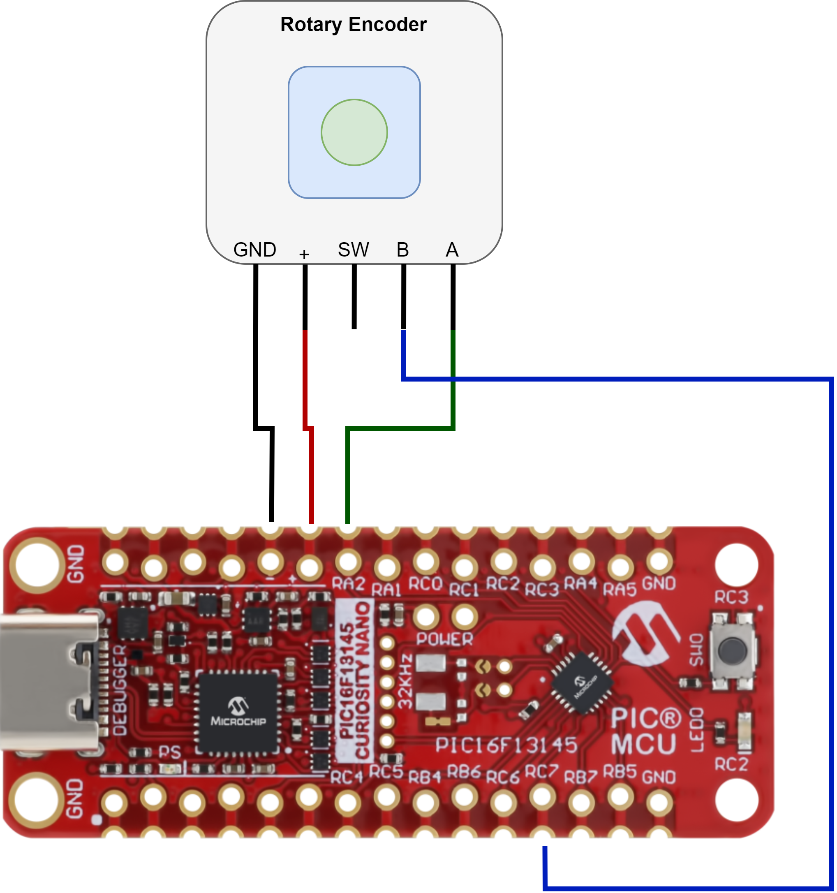

# Quadrature Decoder With Up/Down Counter — Use Case for Configurable Logic Block (CLB) Using the PIC16F13145 Microcontroller With MCC Melody

This repository provides an MPLAB® X project that implements a quadrature decoder circuit using the CLB peripheral.

The CLB peripheral is a collection of logic elements that can be programmed to perform a wide variety of digital logic functions. The logic function may be completely combinatorial, sequential, or a combination of the two, enabling users to incorporate hardware-based custom logic into their applications.

Quadrature signals are the standard output waveforms of incremental encoders that come with motors. They provide information about motor direction and shaft position. There are two types of encoders - linear and rotary - and each can have two types of measurement: absolute and incremental. There are also different technologies used for encoders: magnetic, optical, inductive, capacitive, and laser.

The main categories of encoders are absolute and incremental. A rotary absolute encoder outputs a unique code for each position of the motor's shaft. If the power of this encoder is lost and the shaft is rotated, the encoder can return the correct position of the shaft. The rotary incremental encoder generates pulses while the shaft is rotated. If any pulse is missed, then the shaft position cannot be determined correctly anymore. This application will use a rotary incremental encoder to show how to decode quadrature signals.

The following image highlights the clockwise (CW) and counterclockwise (CCW) conditions on the quadrature signals A and B. When signal A leads signal B (on rising or falling edge), it will be a clockwise detection, otherwise, when signal B leads signal A (on rising or falling edge), it will be a counterclockwise detection.

 

## Related Documentation

More details and code examples on the PIC16F13145 can be found at the following links:

- [PIC16F13145 Product Page](https://www.microchip.com/en-us/product/PIC16F13145?utm_source=GitHub&utm_medium=TextLink&utm_campaign=MCU8_Apps_PIC16F13145&utm_content=pic16f13145-quadrature-decoder-up-down-mplab-mcc&utm_bu=MCU08)
- [PIC16F13145 Code Examples on Discover](https://mplab-discover.microchip.com/v2?dsl=PIC16F13145)
- [PIC16F13145 Code Examples on GitHub](https://github.com/microchip-pic-avr-examples/?q=PIC16F13145)

## Software Used

- [MPLAB X IDE v6.15 or newer](https://www.microchip.com/en-us/tools-resources/develop/mplab-x-ide?utm_source=GitHub&utm_medium=TextLink&utm_campaign=MCU8_Apps_PIC16F13145&utm_content=pic16f13145-quadrature-decoder-up-down-mplab-mcc&utm_bu=MCU08)
- [MPLAB® XC8 v2.45 or newer](https://www.microchip.com/en-us/tools-resources/develop/mplab-xc-compilers?utm_source=GitHub&utm_medium=TextLink&utm_campaign=MCU8_Apps_PIC16F13145&utm_content=pic16f13145-quadrature-decoder-up-down-mplab-mcc&utm_bu=MCU08)
- [PIC16F1xxxx_DFP v1.23.382 or newer](https://packs.download.microchip.com/)

## Hardware Used

- The [PIC16F13145 Curiosity Nano Development board](https://www.microchip.com/en-us/development-tool/EV06M52A?utm_source=GitHub&utm_medium=TextLink&utm_campaign=MCU8_Apps_PIC16F13145&utm_content=pic16f13145-quadrature-decoder-up-down-mplab-mcc&utm_bu=MCU08) is used as a test platform:
   

- Oscilloscope/Logic analyzer

- Rotary encoder
   

**Note:** The setup can be made using a rotary encoder or a motor with encoder. In this example we will focus on the setup that uses a rotary encoder.

- Motor with encoder
   

## Operation

To program the Curiosity Nano board with this MPLAB X project, follow the steps provided in the [How to Program the Curiosity Nano Board](#how-to-program-the-curiosity-nano-board) chapter. 

## Concept

This application showcases the capabilities of the CLB peripheral by creating a quadrature decoder that decodes the waveforms from a rotary encoder and a 4-bit up/down counter circuit used to track the decoded counts. The circuit has two inputs, the decoded counts from the encoder, and outputs four signals corresponding to the 4-bit up/down counter.
The decoder circuit implementation is figured in the picture below:

 

The phase signals from the rotary encoder have glitches when transitioning, so a debouncing circuit is used to avoid false detections. The debouncing circuit is presented in the figure below:

 

To detect a clockwise turn of the rotary encoder the phase A signal has to lead the phase B signal on either rising or falling edge. There are two scenarios:

- rising edge detected on phase B and the phase A high
- falling edge detected on phase B and the phase A low

To detect a counterclowise turn of the rotary encoder the phase B signal has to lead the phase A signal on either rising or falling edge. There are two scenarios:

- rising edge detected on phase A and the phase B high
- falling edge detected on phase A and the phase B low

 

To implement edge detection for the phase signals the following edge detector circuits have been used:

### Rising edge detector circuit

 

### Falling edge detector circuit

 

Below is the implementation for the 4-bit up/down counter circuit:

 

## Setup

The following peripheral and clock configurations are set up using MPLAB® Code Configurator (MCC) Melody for the PIC16F13145:

1. Configurations Bits:

   - CONFIG1:
     - External Oscillator mode selection bits: Oscillator not enabled
     - Power-up default value for COSC bits: HFINTOSC (1MHz)
        
   - CONFIG2:
     - Brown-out reset enable bits: Brown-out reset disabled
        
   - CONFIG3:
     - WDT operating mode: WDT Disabled, SEN is ignored
        

2. Clock Control:

   - Clock Source: HFINTOSC
   - HF Internal Clock: 32_MHz
   - Clock Divider: 1
      

3. CLB1:

   - Enable CLB: Enabled
   - Clock Selection: LFINTOSC
   - Clock Divider: Divide clock source by 32
      

4. CRC:

   - Auto-configured by CLB

5. NVM:

   - Auto-configured by CLB

6. UART1:

   - Requested Baudrate: 115200
   - Data Size: 8
   - Redirect Printf to UART: Enabled
      

7. Pin Grid View:

   - EUSART1 TX: RB7
   - EUSART1 RX: RB5
   - CLBPPSOUT0: RC0 (4-bit counter bit 0)
   - CLBPPSOUT1: RC1 (4-bit counter bit 1)
   - CLBPPSOUT2: RC2 (4-bit counter bit 2)
   - CLBPPSOUT3: RC3 (4-bit counter bit 3)
   - CLBIN0PPS: RA2 (phase A)
   - CLBIN1PPS: RC7 (phase B)
      

The following pin configurations must be made for this project:

| Pin | Configuration |          Function           |
| :-: | :-----------: | :-------------------------: |
| RA2 |     Input     |       Encoder Phase A       |
| RC7 |     Input     |       Encoder Phase B       |
| RB5 |    Output     |         EUSART1 TX          |
| RB7 |     Input     |         EUSART1 RX          |
| RC0 |    Output     | 4-bit up/down counter bit 0 |
| RC1 |    Output     | 4-bit up/down counter bit 1 |
| RC2 |    Output     | 4-bit up/down counter bit 2 |
| RC3 |    Output     | 4-bit up/down counter bit 3 |

 

## Demo

The setup for the demo is presented in the diagram below.

 

In this demo, everytime a clockwise or counterclockwise pulse is detected a message is printed on the serial terminal.

 

Below is presented a logic analyzer capture that contains the waveforms corresponding to the messages sent to the terminal in the figure above.

 

**Note:** Follow the steps in the [How to use MPLAB® Data Visualizer](#how-to-use-mplab®-data-visualizer-tbd) section to set up the Data Visualizer so that it can correctly show the text messages through UART1.

## Summary

This application showcases how to create a quadrature decoder circuit that can detect and count clockwise and counterclockwise pulses on rising and falling edges of the quadrature signals using the CLB peripheral.

## How to use MPLAB® Data Visualizer [#TBD]

This section illustrates how to use the MPLAB® X Data Visualizer. This can be applied to any other projects.

### Operation

1. Open the software terminal in MPLAB® X IDE. Left click on the **Data Visualizer** button.
     

2. Select the **Input Source** corresponding to the PIC16F13145 in the right side. 

3. Identify the coresponding COMx that is represented by the PIC16F13145 Curiosity Nano Board and select it in the **Connections** tab in the left side. 

4. Set the specific **Baud Rate**, in this case **115200**. 

5. Press **Start streaming COMx button**. The text messages will appear in the **Terminal** tab.
    

## How to Program the Curiosity Nano Board [#TBD]

This chapter demonstrates how to use the MPLAB X IDE to program a PIC® device with an Example_Project.X. This is applicable to other projects.

1.  Connect the board to the PC.

2.  Open the Example_Project.X project in MPLAB X IDE.

3.  Set the Example_Project.X project as main project.
     Right click the project in the **Projects** tab and click **Set as Main Project**.
     

4.  Clean and build the Example_Project.X project.
     Right click the **Example_Project.X** project and select **Clean and Build**.
     

5.  Select **PICxxxxx Curiosity Nano** in the Connected Hardware Tool section of the project settings:
     Right click the project and click **Properties**.
     Click the arrow under the Connected Hardware Tool.
     Select **PICxxxxx Curiosity Nano** (click the **SN**), click **Apply** and then click **OK**:
     

6.  Program the project to the board.
     Right click the project and click **Make and Program Device**.
     

 

---

## Menu

- [Back to Concept](#concept)
- [Back to Setup](#setup)
- [Back to Demo](#demo)
- [Back to Summary](#summary)
- [Back to How to use MPLAB® Data Visualizer](#how-to-use-mplab®-data-visualizer-tbd)
- [Back to How to Program the Curiosity Nano Board](#how-to-program-the-curiosity-nano-board-tbd)
- [Back to Top](#quadrature-decoder-with-updown-counter--use-case-for-configurable-logic-block-clb-using-the-pic16f13145-microcontroller-with-mcc-melody)
